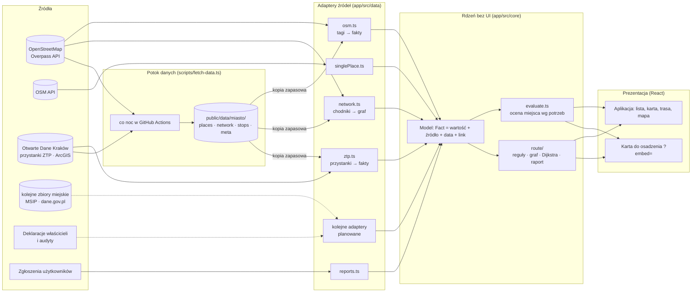
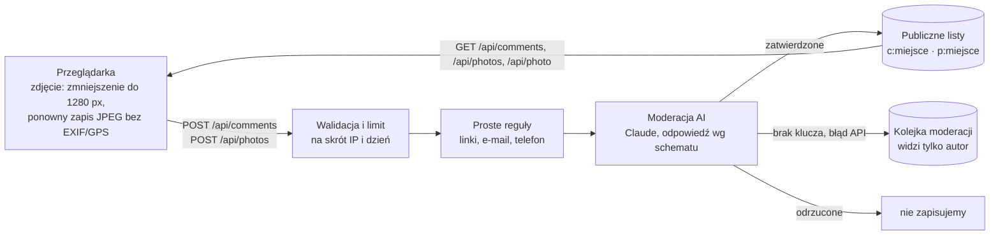

# Architektura

## Zasada: pozyskiwanie danych oddzielone od prezentacji

- **Adaptery** (`app/src/data`) znają format źródła i zamieniają go na wspólny model `Fact` z danymi pochodzenia. Nic poza nimi nie zna tagów OSM ani formatów zbiorów miejskich.
- **Rdzeń** (`app/src/core`) to czysty TypeScript bez Reacta i przeglądarki: model, reguły oceny, routing. Jest testowany jednostkowo (`npm test`) i uruchamiany w Node przez potok danych.
- **Prezentacja** (`app/src/components`, `App.tsx`, `EmbedApp.tsx`) tylko wyświetla wynik oceny. Tę samą ocenę pokazuje pełna aplikacja i karta osadzona u partnera.
- **Potok** (`app/scripts/fetch-data.ts`) używa tych samych adapterów co przeglądarka i zapisuje statyczne pliki, z których aplikacja korzysta, gdy źródło na żywo nie odpowiada.
- **Społeczność** (`app/src/community`, `app/api`) to opinie i zdjęcia. Jest osobnym modułem: bez serwera aplikacja działa dalej, a opinie zapisują się w przeglądarce.

## Warstwy mapy

Mapa pokazuje tylko Kraków: koło o promieniu ok. 23 km wokół środka miasta, czyli miasto z pasem ok. 5 km (`CITY_RADIUS_KM` w `MapView.tsx`). Kamery nie da się przesunąć ani oddalić poza kwadrat opisany na tym kole, kafelki mapy, zdjęcia lotniczego i rzeźby terenu nie są poza nim pobierane, a wszystko poza kołem zakrywa jednolita maska. Przycisk „moja lokalizacja” osobie spoza tego obszaru mówi wprost, że mapa obejmuje tylko miasto.

Od dołu: podkład OpenFreeMap (ulice, budynki 3D, etykiety) z cieniowaniem rzeźby terenu; nad ulicami i pod budynkami **zdjęcie lotnicze** (ortofotomapa GUGiK, domyślnie włączona, przycisk z satelitą przełącza na rysowaną mapę; w 2D budynki 3D znikają, bo widać prawdziwe dachy; gdy kafelek zdjęcia jeszcze się wczytuje, prześwituje rysowana mapa, a gdy serwis nie działa, mapa sama wraca do wersji rysowanej); schody z podkładu (OpenMapTiles `transportation`, `subclass=steps`) wyróżnione czerwoną przerywaną linią, bo są barierą dla wózków; trasa; ławki, miejsca parkingowe dla osób z niepełnosprawnościami i windy z OpenStreetMap (`amenitiesFromOsm`, od powiększenia 15,5); pinezki miejsc; zgłoszenia użytkowników.

- **Pinezka** ma kolor i znak w rogu według oceny (znak powtarza ocenę kształtem, nie tylko kolorem) oraz ikonę rodzaju miejsca. Ikony są rysowane na żądanie (`setMissingStyleImageResolver`) dla par rodzaj + ocena, które są na ekranie.
- Pinezki, które by się nakładały, chowają się jak w aplikacjach map: najpierw zostają miejsca spełniające potrzeby, przybliżenie pokazuje resztę. Wybrane miejsce jest zawsze widoczne. Lista zawsze zawiera wszystkie miejsca.
- Gdy podkład nie odpowiada, zostają cieniowanie terenu, trasy, udogodnienia i pinezki na neutralnym tle.

## Opinie i zdjęcia

- **Magazyn**: Upstash Redis przez REST (`UPSTASH_REDIS_REST_URL/TOKEN` albo `KV_REST_API_URL/TOKEN`), lokalnie plik `app/.data/community.json`, w testach pamięć. Interfejs `Store` (`api/_lib/store.ts`) pozwala podmienić go na Postgres, D1 albo bazę partnera.
- **Moderacja** (`api/_lib/moderation.ts`): model Claude zwraca decyzję w stałym schemacie (Zod). Dla zdjęć także: czy widać twarze, czy tablice rejestracyjne są czytelne, czy zdjęcie dotyczy miejsca oraz widoczne fakty (stopnie, podjazd, poręcz, drzwi automatyczne). Twarze, tablice i zdjęcia niezwiązane z miejscem odrzuca kod, nie tylko model. Treść użytkownika jest w znacznikach i model ma polecenie, by nie wykonywać poleceń z niej ani z tekstu na zdjęciu. Włączony jest zapasowy model po stronie serwera (`server-side-fallback`), gdy główny odmówi. Odmowa modelu oznacza odrzucenie, a błąd API lub brak klucza oznacza kolejkę moderacji. Model można zmienić zmienną `MODERATION_MODEL`.
- **Fakty ze zdjęć** są pokazywane osobno, jako „Ze zdjęć użytkowników (AI, niezweryfikowane)”, i nie wpływają na ocenę miejsca.
- **Zdjęcia otwarte** (`src/community/externalPhotos.ts`): tagi OSM `image`, `wikimedia_commons`, `wikidata` → Wikimedia Commons API, z autorem i licencją przy każdym zdjęciu.

## Przepływ danych

1. Start aplikacji: `usePlacesData` pobiera miejsca z Overpass, przy błędzie korzysta z Cache Storage albo kopii nocnej i ustawia status źródła (`live` / `cached` / `unavailable`). Równolegle `loadStops` (`ztp.ts`) pobiera przystanki z otwartej warstwy miasta, a gdy ta nie odpowie w 8 s, bierze kopię nocną; każde źródło ma własny status w „O danych”.
2. Dane przykładowe są dołączane do pasujących miejsc OSM (`merge.ts`: nazwa + odległość < 150 m), a zgłoszenia użytkowników dodawane jako osobne fakty (`withCorrections`).
3. `evaluatePlace(place, needs)` (przystanek oceniany jest po peronie, pozostałe miejsca po wejściu, drzwiach, piętrach i toalecie) zwraca listę ustaleń (bariera, utrudnienie, brak danych, OK, informacja), każde z faktami i sprzecznościami, oraz wynik końcowy.
4. Trasa: `useRoute` pobiera sieć chodników dla obszaru trasy (`loadNetwork`, z kopią zapasową), `buildGraph` buduje graf, a `planRoute` liczy trasę dopasowaną do potrzeb i najkrótszą, po czym `analyze` tworzy raport ze zdarzeniami po drodze.
5. Zmiana potrzeb przelicza ocenę i trasę lokalnie, bez ponownego pobierania.

## Jak dodać…

### …nowe źródło danych

1. Dopisz źródło w `app/src/core/sources.ts` (nazwa PL/EN, rodzaj, poziom wiarygodności, licencja).
2. Napisz adapter w `app/src/data/` zwracający `Place[]` albo fakty (`Fact` z `source`, `date`, `url`).
3. Dołącz go w `usePlacesData` (na żywo) i/lub w `scripts/fetch-data.ts` (kopia nocna). `meta.json` automatycznie zapisuje status i datę.
4. Opisz zbiór w konfiguracji miasta (`datasets`), a pojawi się w „O danych”.

Przykład przejścia tych czterech kroków: adapter przystanków ZTP (`app/src/data/ztp.ts`, testy w `ztp.test.ts`), źródło `ztp` w `sources.ts`, adres warstwy w `cities/krakow.ts` (`stops`).

### …nową kategorię miejsc

Dodaj klucz w `CategoryKey` (`core/types.ts`), regułę w `categorize()` (`data/osm.ts`), zapytanie w `placesQuery` i tłumaczenia w `i18n/pl.ts` / `i18n/en.ts`.

### …nową potrzebę lub atrybut

Dodaj atrybut w `FactValues`, mapowanie tagów w adapterze, regułę w `evaluate.ts` (lub `route/rules.ts` dla tras) i komunikaty w słownikach. Testy w `core/*.test.ts` pokazują wzorzec.

### …nowe miasto

1. Skopiuj `app/src/cities/krakow.ts`: identyfikator, nazwa, środek, obszar (`bbox`), obszar sieci chodników, przykładowe trasy, lista zbiorów danych.
2. Zarejestruj miasto w `CITIES`.
3. `npm run data:fetch -- <miasto>` tworzy kopię zapasową.
4. Sprawdź pokrycie danych OSM (odsetek miejsc z tagami dostępności, chodników z nawierzchnią, przejść z krawężnikami). Przy niskim pokryciu zaplanuj mapathon z lokalnymi organizacjami.

Reszta aplikacji jest niezależna od miasta. Technicznie to 1–2 dni pracy, a uzupełnienie danych to proces na tygodnie (patrz `docs/biznes.md`).

## Stos technologiczny i zależności

| Element | Technologia | Licencja | Zależność zewnętrzna | Alternatywa |
|---|---|---|---|---|
| Aplikacja | React 19, TypeScript, Vite | MIT | — | — |
| Mapa | MapLibre GL JS | BSD-3-Clause | — | — |
| Podkład mapy | OpenFreeMap (kafelki wektorowe) | dane ODbL, styl OpenMapTiles | OpenFreeMap (darmowe, bez SLA) | własne PMTiles na S3/R2, MapTiler |
| Zdjęcie lotnicze | Ortofotomapa GUGiK, WMTS w EPSG:3857 (do 0,4 m na piksel w aplikacji) | otwarte dane publiczne, wymagane wskazanie źródła | Geoportal.gov.pl (bez klucza) | Esri World Imagery, Sentinel-2 cloudless (niższa rozdzielczość) |
| Mapa 3D | MapLibre: budynki (fill-extrusion), rzeźba terenu i cieniowanie, niebo | BSD-3-Clause | Terrain Tiles (AWS Open Data, bez klucza) | własne kafelki wysokości; bez nich mapa zostaje 3D, ale płaska |
| Model 3D wejścia | three.js, @react-three/fiber, drei | MIT | — | — |
| Ikony | Lucide | ISC | — | — |
| Opinie i zdjęcia | funkcje Node w `app/api` (Vercel), Upstash Redis | — | Vercel, Upstash | dowolny serwer Node, Postgres, Cloudflare Workers + D1 |
| Moderacja AI | Claude API (Anthropic SDK, Zod) | MIT | Anthropic | inny dostawca moderacji; bez klucza wszystko trafia do moderacji ręcznej |
| Zdjęcia otwarte | Wikimedia Commons API, Wikidata | licencje zdjęć (CC) | Wikimedia | — |
| Dane | OpenStreetMap przez Overpass API | ODbL 1.0 | publiczne instancje Overpass | własna instancja Overpass, kopia nocna |
| Dane miejskie | rejestr przystanków ZTP (Otwarte Dane Miasta Krakowa), ArcGIS FeatureServer | warunki portalu: bezpłatnie, z podaniem źródła i daty | publiczna usługa ArcGIS miasta (bez klucza, bez SLA) | kopia nocna; pliki eksportu z portalu |
| Potok danych | Node 22 (TypeScript natywnie), GitHub Actions | — | GitHub | dowolny cron / CI |
| Testy, lint | Vitest, Oxlint | MIT | — | — |

**Przenośność**: wynik budowania to statyczne pliki (`app/dist`) plus statyczne kopie danych (`app/public/data`). Działa na dowolnym hostingu statycznym albo serwerze www, bez bazy danych. Opinie i zdjęcia to osobny, wymienny moduł (`app/api`: `GET/POST /api/comments`, `GET/POST /api/photos`, `GET /api/photo`, `GET /api/health`). Bez niego aplikacja zapisuje opinie tylko w przeglądarce. Serwer zgłoszeń barier (planowany) dostanie podobne API (`POST /reports`, `GET /reports?bbox=`) i może działać na Supabase/PostgreSQL, Cloudflare Workers + D1 albo w infrastrukturze partnera.

## Testy

- `npm test`: 40+ testów rdzenia i API (walidacja, limity, moderacja z atrapą modelu, zdjęcia oczekujące niepubliczne), m.in. ocena miejsc (bariera, podjazd, sprzeczne źródła, brak danych ≠ dostępność, dane stare, zgłoszenia wygasające), adapter OSM (wejścia budynku, daty potwierdzeń, ławki w pobliżu), routing (omijanie schodów, przejścia bez danych, porównanie z najkrótszą, omijanie zgłoszonych przeszkód).
- Kontrola dostępności: axe-core na głównych ekranach (0 naruszeń) i przejście klawiaturą. Opis w `docs/dostepnosc.md`.
